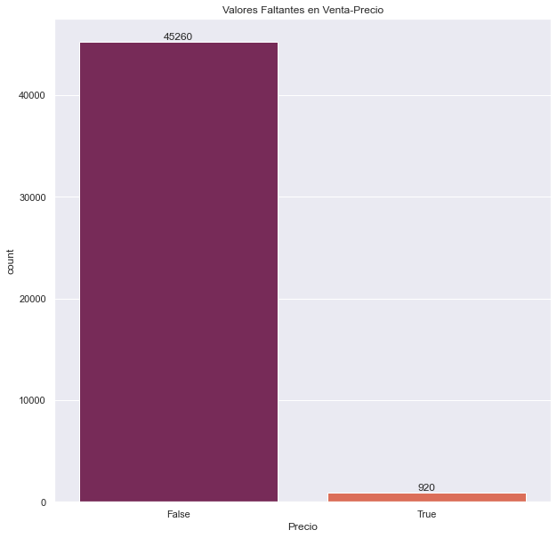
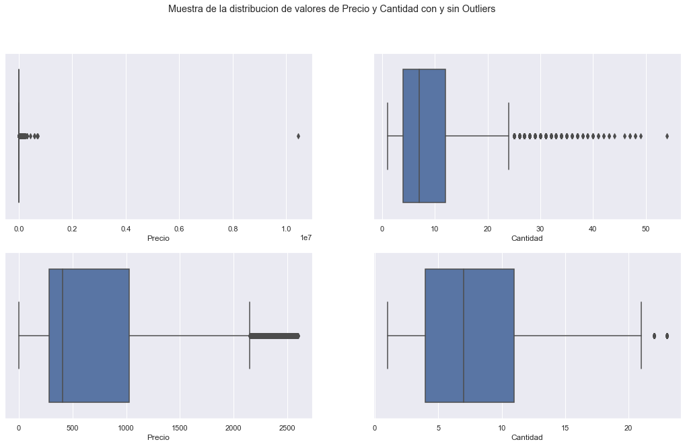
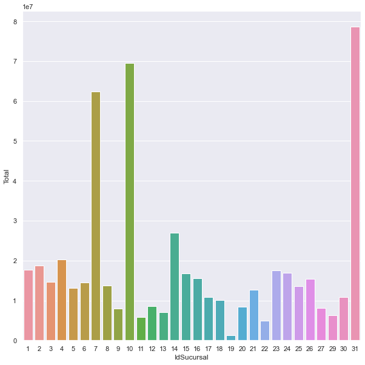
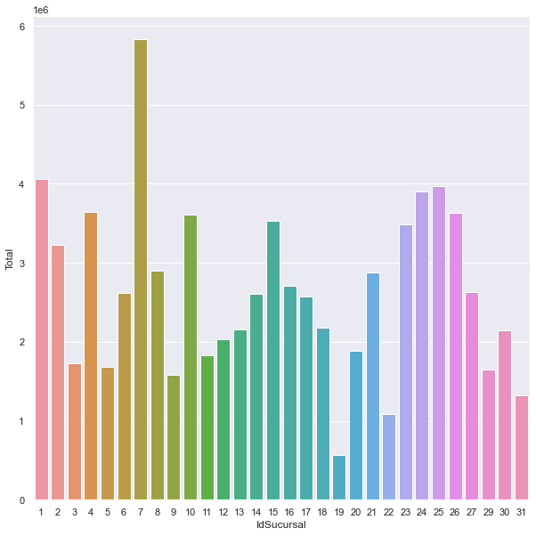

# ETL Project - Initial load and update - Data Normalization

In this project we will normalize the data obtained, looking for null values, atypical values, considering remote values ​​and analyzing what to do with each of them. All these transformations must be done automatically, since the data we have from the project is only the beginning of a list of updates that will be carried out.  

 

In the Informe.ipynb file I make a detailed exploration and explained step by step to carry out the transformation of the data.  

In this graph we analyze the amount of null values ​​of each column of the tables, to analyze the percentages of these values ​​and thus be able to decide what to do with these results. 

 

 

For example, in the graph below I show the distribution of the Quantities and Prices of Purchases made by the company, considering the outliers at the bottom and not considering them at the top. 

 

 

At the end of the analysis we make (based on a KPI) a recommendation for the company on where it is more optimal to open a new branch. For that we carry out an analysis of the total income by branch, with and without remote values. In this way we reach two conclusions to contribute to those responsible for making the decision.  

 
 

 

In the project we have 2 important files Create.py which is the program that was made for the creation of the normalized datasets, the creation of a registry csv that will record the data updates that will be made. The second file is Update.py which will take the Sales and Customer datasets from the Datasets folder and update the corresponding data. 

 

# Proyecto ETL - Carga inicial y actualizacion - Normalización de Datos

En este proyecto normalizaremos los datos obtenidos, buscando valores nulos, valores atípicos, considerando valores remotos y analizando que hacer con cada uno de ellos. Todas estas transformaciones deben hacerse de forma automática, ya que los datos que tenemos del proyecto son solo el principio de una lista de actualizaciones que se llevarán a cabo. 

 

En el archivo Informe.ipynb realizo una exploración detallada y explicada paso a paso para realizar la transformación de los datos. 

En este gráfico analizamos la cantidad de valores nulos de cada columna de las tablas, para analizar los porcentajes de estos valores y así poder decidir qué hacer con estos resultados. 

 

 

Por ejemplo, en el siguiente gráfico muestro la distribución de las Cantidades y Precios de las Compras realizadas por la empresa, considerando los valores atípicos en la parte inferior y no considerándolos en la parte superior. 

 

 

Al final del análisis hacemos (en base a un KPI) una recomendación para la empresa sobre dónde es más óptimo abrir una nueva sucursal. Para ello realizamos un análisis de los ingresos totales por sucursal, con y sin valores remotos. De esta forma llegamos a dos conclusiones para aportar a los responsables de tomar la decisión.  

 
 

 

En el proyecto tenemos 2 archivos importantes Create.py que es el programa que se realizo para la creacion de los datasets normalizados, la creacion de un csv de registro que anotara las actualizaciones de los datos que se realizaran. El segundo archivo es el Update.py que tomara los dataset de Ventas y Clientes de la carpeta Datasets y realizara la actualizacion de los datos correspondientes. 

 

